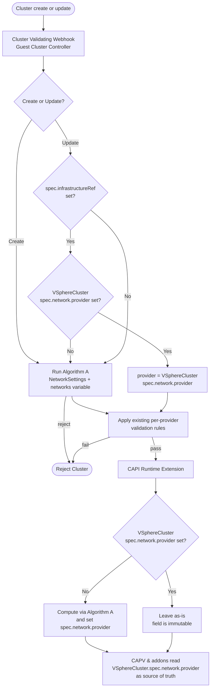

# One-Pager: Support VKS Cluster Transition from VDS / NSX T1 to NSX VPC Network

Metadata:
- **Author:** Yifeng Xiao
- **ETA:** 4 months
- **JIRA:** [GCM-16559](https://vmw-jira.broadcom.net/browse/GCM-16559)

## Business Problem Being Solved
Today, a Supervisor Cluster is bound to a single global network provider: VDS, NSX T1, or NSX VPC. Many advanced VCF Private Cloud capabilities (multi-tenancy, network self-service, etc.) require NSX VPC. Starting with VCF 9.2, the Supervisor will support transitioning brownfield deployments from VDS or NSX T1 to NSX VPC. As an important workload on Supervisor, VKS must transition along with the Supervisor namespaces it runs in.

## Goals
- **Transition Existing Infrastructure:** Transition the underlying infrastructure of existing VKS Clusters from VDS or NSX T1 to NSX VPC, in-place (no VKS Node redeployment) and with no impact to workloads running inside the Clusters.
- **Maintain Existing Clusters:** In a brownfield (transitioned) Supervisor namespace, **existing Clusters keep running unchanged**. Their `networks` variable continues to reference the legacy APIs (`Network` or `VirtualNetwork`), even though the underlying infrastructure runs on VPC.
- **Define New Cluster Behavior in Brownfield:** New Clusters created in a brownfield namespace can reference either the legacy APIs (`Network`/`VirtualNetwork`) or the new NSX VPC APIs (`SubnetSet`/`Subnet`). **We certainly prefer users to start using the NSX VPC APIs.**
- **Define New Cluster Behavior in Greenfield:** In a greenfield Supervisor namespace, the Cluster spec's `networks` variable must **only** reference APIs of the namespace network provider (In the transitioned Supervisor it is `SubnetSet`/`Subnet`).
- **Enable DHCP Support:** Support DHCP `SubnetSet` as the Node primary network.

## Non-Goals
- Mixing heterogeneous network API kinds (e.g., `Network` and `SubnetSet`) within a single Cluster's `networks` variable.
- Mutating the network API kind referenced by an existing Cluster's `networks` variable (e.g., rewriting it from `Network` / `VirtualNetwork` to `SubnetSet` / `Subnet`). The underlying infrastructure is still transitioned to VPC; only the API reference in the Cluster spec is immutable.
- Transitioning Clusters that use SR-IOV network adapters.
- Supervisor Cluster Transition is out of scope of this design.

## Big Picture
The diagram below shows how the network provider is assigned to a VKS Cluster. The network provider lives on `VSphereCluster.spec.network.provider` and is the single source of truth. The Cluster validating webhook computes the provider on the fly to validate `networks`-variable references, and the CAPI Runtime Extension sets `VSphereCluster.spec.network.provider` the first time it sees the Cluster. Once set, the field is immutable and all network-topology-aware consumers (CAPV, Addon Manager, etc.) read it directly.



## Key Concept: Per-Namespace Network Provider
The transition happens namespace-by-namespace, driven by the VCFA tenant admin. At any point in time, different namespaces in the same Supervisor Cluster may be on different network providers.

To express this, Net Operator introduces a namespace-scoped CRD `NetworkSettings` (always named `default`, one per namespace). It is the single source of truth for "which network provider does this namespace use?".

Before transition:
```yaml
apiVersion: netoperator.vmware.com/v1alpha1
kind: NetworkSettings
metadata:
  namespace: foo
  name: default
provider: VSphereDistributed   # VSphereDistributed | NSXTier1 | VPC
```

After transition:
```yaml
apiVersion: netoperator.vmware.com/v1alpha1
kind: NetworkSettings
metadata:
  namespace: foo
  name: default
provider: VPC
legacyProvider: VSphereDistributed  # The original network provider (e.g., VSphereDistributed or NSXTier1) in a transitioned namespace.
```

The **legacyProvider** field is non-empty only in transitioned (brownfield) namespaces, where it stores the original network provider. It is empty in greenfield VPC namespaces.

Reference: [Supervisor Networking Stack transition from VDS to VPC](https://vmw-confluence.broadcom.net/spaces/NSBU/pages/2404719574/Supervisor+Networking+Stack+transition+from+VDS+to+VPC#SupervisorNetworkingStacktransitionfromVDStoVPC-SupervisorNamespaceNetworkMigrationCR).

## Transition Phases
1. **Import Supervisor Cluster to VCFA.**
   - Two global network providers can now coexist in the Supervisor.
   - New (greenfield) namespaces are created on NSX VPC (`provider: VPC`, legacyProvider empty). VKS Clusters in them follow the existing VPC defaulting and validation rules.
   - Existing (brownfield) namespaces remain on VDS or NSX T1. VKS Clusters in them keep the existing VDS / NSX T1 behavior.
2. **Transition an individual brownfield namespace.** `NetworkSettings.provider` flips to `VPC` and `NetworkSettings.legacyProvider` is populated. The namespace's underlying network infrastructure is migrated to NSX VPC: each pre-existing `Network` / `VirtualNetwork` is mapped 1:1 to a `Subnet`, and VM vNICs are reattached to the mapped `Subnet`. Existing Cluster specs are *not* rewritten – they keep referencing the original `Network` / `VirtualNetwork` object names, but those references now resolve, via Network.spec.providerRef, to the corresponding `Subnet` on VPC. From this point, VKS in that namespace:
   - Continues to honor existing Cluster specs that reference the old `Network` / `VirtualNetwork` APIs; their Nodes now run on the mapped VPC `Subnet` without any spec change or VM redeployment.
   - For newly created Clusters, accepts network references to either the old `Network` / `VirtualNetwork` APIs or the new `SubnetSet` / `Subnet` APIs (but not a mix of both within the same Cluster spec), and defaults to NSX VPC when no explicit network reference is provided.
   - Keeps each existing Cluster's network provider (`VSphereDistributed` / `NSXTier1` / `VPC`) pinned to what it had at creation, recorded on `VSphereCluster.spec.network.provider`, so VKS applies the original provider's defaulting and validation rules to existing Clusters even though the underlying infrastructure is now VPC.
3. **Day-2 operations and cleanup.** Out of scope for this doc.

## Current VKS Node Network Behavior
VKS keeps the existing per-provider defaulting and validation rules unchanged. Only the input that decides "which provider applies to this Cluster" changes.

| Provider | API | Node primary network | Node secondary network |
| --- | --- | --- | --- |
| VDS | `Network` | Default Network of the Supervisor Namespace; not exposed in Cluster spec. | User-specified `Network` in the namespace. |
| NSX T1 | `VirtualNetwork` | VKS auto-creates a `VirtualNetwork`. | Not supported. |
| NSX VPC | `SubnetSet` / `Subnet` | VKS auto-creates a `SubnetSet` if not specified; users can specify a pre-created `SubnetSet`. | User-specified `SubnetSet` or `Subnet`. |

## Architecture Areas

### Per-Cluster Network Provider
Each VKS Cluster's network provider is recorded on the corresponding `VSphereCluster.spec.network.provider` field (Note: ExternallyManaged is introduced for Supervisor Cluster and will never be apply to any workload Cluster, see [One-Pager: An ExternallyManaged CAPV Network Provider for the Supervisor Cluster](./one-pager-externally-managed-capv-network-provider.md)):
```
VSphereDistributed | NSXTier1 | VPC | ExternallyManaged
```

This is the single source of truth for per-Cluster network topology. The field is **immutable once set**. The CAPI Runtime Extension is the only writer; the Guest Cluster Controller (GCC) validating webhook and Runtime Extension share a common algorithm (Algorithm A below) to compute the value from `NetworkSettings` and the Cluster's `networks` variable.

Why store it on `VSphereCluster` rather than a `Cluster` label or `ClusterClass` variable:
- VKS supports old, frozen `ClusterClass` versions and custom `ClusterClass` (e.g. the DSM use case), so a variable-based representation is not viable.
- A typed `VSphereCluster` field is immutable, validated by CAPV, and naturally consumed by CAPV's `VSphereMachine` logic and by addons.

#### Algorithm A: Compute Network Provider from NetworkSettings
Given a Cluster and its namespace's `NetworkSettings` (`ns`):

```
switch ns.provider:
case VSphereDistributed, NSXTier1:
    networkProvider = ns.provider                // not transitioned

case VPC:
    if ns.legacyProvider is empty:
        networkProvider = VPC              // greenfield
    else:
        // brownfield (transitioned): both old and new APIs are allowed
        switch interfaces in cluster.spec.topology.variables.networks:
        case empty:
            networkProvider = VPC          // follow VPC defaulting
        case only Network refs:
            if ns.legacyProvider == VSphereDistributed:
                networkProvider = VSphereDistributed
            else:
                reject                           // original provider is NSX T1;
                                                 // cannot reference Network CR
        case only VirtualNetwork refs:
            reject                               // reference to VirtualNetwork
                                                 // is not supported
        case only SubnetSet/Subnet refs:
            networkProvider = VPC
        case mixed:
            reject                               // heterogeneous not supported
default:
    reject                                       // empty or invalid network provider
```
Note: For existing Clusters, the Runtime Extension sets `VSphereCluster.spec.network.provider` prior to the Namespace transition. The VCFA migrator also verifies that this field is set (see [Compatibility check](https://vmw-confluence.broadcom.net/spaces/NSBU/pages/2404719574/Supervisor+Networking+Stack+transition+from+VDS+to+VPC#SupervisorNetworkingStacktransitionfromVDStoVPC-Compatibilitycheck)).

### Guest Cluster Controller

#### Cluster Validating Webhook (on create)
Run Algorithm A to determine the network provider, then apply the existing per-provider validation rules using that provider. Reject the Cluster if Algorithm A rejects.

#### Cluster Validating Webhook (on update)
Inspect `Cluster.spec.infrastructureRef`. Example:
```yaml
apiVersion: cluster.x-k8s.io/v1beta2
kind: Cluster
metadata:
  name: coffee
  namespace: vks-test
spec:
  clusterNetwork:
    pods:
      cidrBlocks:
      - 192.0.2.0/16
    serviceDomain: cluster.local
    services:
      cidrBlocks:
      - 198.51.100.0/12
  infrastructureRef:
    apiGroup: vmware.infrastructure.cluster.x-k8s.io
    kind: VSphereCluster
    name: coffee-jgnbw
```
- If `infrastructureRef` is set, look up the referenced `VSphereCluster`:
  - If `spec.network.provider` is non-empty, use it as the network provider for validation. This is the steady state.
  - Otherwise (the Runtime Extension hasn't set it yet), fall back to Algorithm A.
- If `infrastructureRef` is not set, use Algorithm A.

Existing per-provider validation logic is unchanged; only the input ("which provider applies to this Cluster") changes.

### Cluster API vSphere Provider (CAPV)
- Add a feature gate `ClusterNetworkProvider` that toggles this feature.
- Add a new field `VSphereCluster.spec.network.provider`. The `VSphereMachine` controller and webhook drive their behavior off this field instead of the `--network-provider` command-line flag. Per-provider logic and validation are unchanged.
- `spec.network.provider` is immutable once set. The CAPV validating webhook rejects updates that change a non-empty value.

```yaml
apiVersion: vmware.infrastructure.cluster.x-k8s.io/v1beta1
kind: VSphereCluster
metadata:
  name: coffee-769ww
  namespace: tkgs-test
spec:
  network:
    provider: VSphereDistributed | NSXTier1 | VPC | ExternallyManaged
```

### Cluster API Runtime Extension
On each reconcile of a Cluster's topology, inspect the corresponding `VSphereCluster.spec.network.provider`:
- If empty, run Algorithm A and write the result to `VSphereCluster.spec.network.provider`.
- If already set, leave it as-is (the field is immutable).

This handles both new Clusters created after the feature is enabled and existing Clusters that pre-date it (e.g. after upgrading VCF to 9.2): the first reconcile after upgrade computes and pins the provider, so no separate backfill controller is required.

### Addon Manager
Addon Manager treats `VSphereCluster.spec.network.provider` as the source of truth for per-cluster network provider. Network-topology-aware addons (vSphere CPI, Antrea, CSI, etc.) read this field (via the owning `Cluster` → `VSphereCluster` reference) and configure themselves accordingly.

Two APIs are used to manage addon vSphere CPI configuration:
- **`VSphereCPIConfig` (legacy):** The `VSphereCPIConfig` controller reads `VSphereCluster.spec.network.provider` for the owning `Cluster` and sets `vpcNetworkEnabled` on the rendered data values when the provider indicates a VPC-backed network.
- **`AddonConfig` (new):** The `AddonConfigDefinition` derives the `vpcNetworkEnabled` value from the same field.

Antrea, CSI, and any other network-topology-aware addons follow the same design: they consume `VSphereCluster.spec.network.provider` via either `VSphereCPIConfig`-style controllers or the new `AddonConfigDefinition`, ensuring a single source of truth across all addons.

#### Behavior After Namespace Transition (NSX T1 → NSX VPC)
When a namespace is transitioned from NSX T1 to NSX VPC, `VSphereCluster.spec.network.provider` on existing Clusters remains `NSXTier1` (it was pinned at create time and is immutable). As a result, addon configuration is unchanged for those Clusters. If routable pods are enabled on a Cluster, vSphere CPI continues to use the NSX T1 APIs (`IPPool` and `RouteSet`) for routable pod allocation; NCP watches these resources and generates the corresponding VPC APIs (`IPAddressAllocation` and `StaticRoute`) as a proxy, so traffic works correctly on the underlying VPC network without requiring addon reconfiguration. For details refer to the design doc [Supervisor Networking Stack Transition from Segment Networking to VPC](https://vmw-confluence.broadcom.net/spaces/NSBU/pages/2381982163/Supervisor+Networking+Stack+Transition+from+Segment+Networking+to+VPC).

### Capability Flag
A VKS capability flag `per_namespace_network_provider` gates the feature for all VKS components. It depends on the Supervisor capability flag `supports_per_namespace_network_provider`. If the Supervisor capability is off, VKS falls back to the global network provider.

### Network Provider Name Mapping
When the `supports_per_namespace_network_provider` capability is disabled, VKS receives the global network provider name from Supervisor in its legacy form: `NSX`, `NSX-VPC`, or `vsphere-network`. To keep a single, consistent set of network provider names across VKS components, VKS converts these legacy names to the new names used by the per-namespace network provider feature:

| Legacy name | New name |
| --- | --- |
| `NSX` | `NSXTier1` |
| `NSX-VPC` | `VPC` |
| `vsphere-network` | `VSphereDistributed` |

After conversion, downstream VKS components (Cluster API Runtime Extension, Guest Cluster Controller etc.) only need to handle the new names regardless of whether the capability is enabled or disabled.

## Dependencies

### VM Operator
CAPV explicitly configures the network reference on the `VirtualMachine` CR via `spec.network.interfaces`, and VM Operator performs the actual VM network configuration. Example:

```yaml
apiVersion: vmoperator.vmware.com/v1alpha2
kind: VirtualMachine
metadata:
  name: vks-worker
  namespace: vks-test
spec:
  network:
    interfaces:
    - name: eth0
      network:
        apiVersion: netoperator.vmware.com/v1alpha1
        kind: Network
        name: management-network
    - name: eth1
      mtu: 1700
      gateway4: None   # disabled default route
      gateway6: None   # disabled default route
      network:
        apiVersion: netoperator.vmware.com/v1alpha1
        kind: Network
        name: workload-network
```

In a transitioned namespace, VM Operator must accept `spec.network.interfaces[*].network` references to either the retained Net Operator APIs `Network` / `VirtualNetwork` or the NSX VPC APIs `SubnetSet` / `Subnet`, and resolve each reference to the correct underlying VPC backing. This is what allows existing VKS Clusters to keep their original `Network` / `VirtualNetwork` references in the Cluster spec while their Nodes' vNICs land on the mapped VPC `Subnet`.

## Feature Parity and UX

### Network ↔ Subnet Mapping After Transition
After a namespace transitions to VPC, each existing `Network` is mapped 1:1 to a `Subnet`. Net Operator additionally creates a `SubnetSet` named `vm-default` that references the `Subnet` mapped from the default VDS `Network` (the one labeled `netoperator.vmware.com/is-default: true`). Users who want new Clusters to land on the original default network must explicitly reference `vm-default` in the Cluster `networks` variable.

Example (namespace `foo`, default Network `primary`, secondary Network `secondary`):
```yaml
apiVersion: netoperator.vmware.com/v1alpha1
kind: Network
metadata:
  namespace: foo
  name: primary
  labels:
    netoperator.vmware.com/is-default: "true"
spec:
  type: vpc
  providerRef:
    apiVersion: crd.nsx.vmware.com/v1alpha1
    kind: Subnet
    name: subnet1
---
apiVersion: netoperator.vmware.com/v1alpha1
kind: Network
metadata:
  namespace: foo
  name: secondary
spec:
  type: vpc
  providerRef:
    apiVersion: crd.nsx.vmware.com/v1alpha1
    kind: Subnet
    name: subnet2
---
apiVersion: crd.nsx.vmware.com/v1alpha1
kind: Subnet
metadata:
  namespace: foo
  name: subnet1
spec:
  accessMode: Public
  ipv4SubnetSize: 16
---
apiVersion: crd.nsx.vmware.com/v1alpha1
kind: Subnet
metadata:
  namespace: foo
  name: subnet2
spec:
  accessMode: Public
  ipv4SubnetSize: 16
---
apiVersion: crd.nsx.vmware.com/v1alpha1
kind: SubnetSet
metadata:
  namespace: foo
  name: vm-default
  labels:
    nsxoperator.vmware.com/default-subnetset-for: VirtualMachine
spec:
  subnetNames:
  - subnet1
```

A Cluster pointing at the converted default network:
```yaml
apiVersion: cluster.x-k8s.io/v1beta1
kind: Cluster
metadata:
  name: coffee
  namespace: foo
spec:
  clusterNetwork:
    pods:
      cidrBlocks:
      - 192.0.2.0/16
    serviceDomain: managedcluster.local
    services:
      cidrBlocks:
      - 198.51.100.0/12
  topology:
    class: builtin-generic-v3.8.0
    version: v1.34.1---vmware.1-vkr.4
    controlPlane:
      replicas: 1
    workers:
      machineDeployments:
      - class: node-pool
        name: workers
        replicas: 1
    variables:
    - name: storageClass
      value: wcpglobal-storage-profile
    - name: vmClass
      value: best-effort-small
    - name: networks
      value:
        interfaces:
          primary:
            network:
              apiVersion: crd.nsx.vmware.com/v1alpha1
              kind: SubnetSet
              name: vm-default      # was the default VDS Network "primary"
```

### UX After Transition from NSX T1 to NSX VPC
In an NSX T1 namespace, the Cluster spec `networks.interfaces` variable is not supported: VKS always auto-creates a `VirtualNetwork` for the Cluster, and users have no way to reference one explicitly.

After transition, each existing `VirtualNetwork` is mapped 1:1 to a `SubnetSet`. For existing Clusters, VKS continues to enforce the NSX T1 defaulting and validation rules (keyed off `VSphereCluster.spec.network.provider`), so they keep running against their original auto-created `VirtualNetwork`.

For new Clusters, the namespace is on NSX VPC, so they follow the NSX VPC defaulting and validation rules. There is no UX to reference a pre-existing `VirtualNetwork` from a new Cluster – new Clusters must use `SubnetSet` / `Subnet` references, or rely on VPC defaulting (auto-create a static-IP `SubnetSet`). The `vm-default` injection described in Defaulting Difference Between VDS and VPC only applies to namespaces transitioned from VDS, not from NSX T1.

### DHCP `SubnetSet` Support
In VDS DHCP mode, every `Network` is DHCP and the primary interface always lands on the namespace default `Network`. Today VKS rejects a DHCP `SubnetSet` on the primary interface; we will lift this restriction so users can keep the same DHCP experience after moving to VPC APIs.

Secondary interfaces still cannot use a DHCP `Network` / `SubnetSet` / `Subnet`, because multiple DHCP-attached interfaces produce conflicting default routes.

### SR-IOV
SR-IOV network adapters are only supported on the VDS network provider. A namespace cannot transition to VPC if any VM in the namespace uses a `VMClass` with SR-IOV network adapters. The VCFA Migrator performs this compatibility check before transitioning the namespace; transition is blocked until the offending VMs / `VMClass` references are removed.

Reference: [Compatibility check](https://vmw-confluence.broadcom.net/spaces/NSBU/pages/2404719574/Supervisor+Networking+Stack+transition+from+VDS+to+VPC#SupervisorNetworkingStacktransitionfromVDStoVPC-Compatibilitycheck).

### Defaulting Difference Between VDS and VPC
This section applies to namespaces transitioned from VDS only. On NSX T1, VKS automatically creates a dedicated `VirtualNetwork` for each Cluster instead of attaching VMs to the namespace's default `VirtualNetwork`, so there is no prior default-network UX to preserve; new Clusters in a T1-transitioned namespace follow the standard VPC defaulting.

For new Clusters in a VDS-transitioned namespace, the existing VPC defaulting kicks in: if the manifest does not declare a primary network, VKS auto-creates a `SubnetSet` (static IP) for it. For a minimal manifest like:

```yaml
apiVersion: cluster.x-k8s.io/v1beta1
kind: Cluster
metadata:
  name: coffee
  namespace: foo
spec:
  clusterNetwork:
    pods:
      cidrBlocks:
      - 192.0.2.0/16
    serviceDomain: managedcluster.local
    services:
      cidrBlocks:
      - 198.51.100.0/12
  topology:
    class: builtin-generic-v3.8.0
    controlPlane:
      replicas: 1
    variables:
    - name: storageClass
      value: wcpglobal-storage-profile
    - name: vmClass
      value: best-effort-small
    version: v1.34.1---vmware.1-vkr.4
    workers:
      machineDeployments:
      - class: node-pool
        name: workers
        replicas: 1
```

The behavior would change:
- **Before transition (VDS UX):** VKS uses the namespace default `Network` (possibly DHCP) as the primary network.
- **After transition (VPC UX):** VKS auto-creates a static-IP `SubnetSet`.

This is problematic in a transitioned namespace because:
1. Users' existing automation written against this manifest would silently change behavior.
2. A transitioned namespace is not configured with CIDRs for auto-created subnets, so auto-creation would fail.

**Resolution.** To preserve the original effective network in both transitioned and greenfield namespaces, users must manually configure the primary interface to reference the vm-default SubnetSet:

```yaml
    - name: networks
      value:
        interfaces:
          primary:
            network:
              apiVersion: crd.nsx.vmware.com/v1alpha1
              kind: SubnetSet
              name: vm-default
```

If this is omitted, VKS defaults to auto-creating a static-IP SubnetSet, which will fail if the VPC connectivity profile lacks the necessary CIDR configuration. This failure is visible as a NotReady SubnetSet condition and a quick VKS Cluster Creation failure (NetworkReady: false). The SubnetSet CIDR validation is tracked in [NCP-778](https://vmw-jira.broadcom.net/browse/NCP-778).
